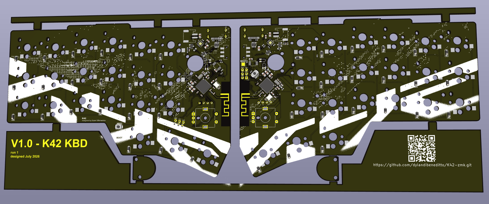

<h1 align="center">K42</h1>

### Features
- **Wireless** BLE
- Onboard **Haptic Feedback**
- **Aluminum** Plate and Rotary Knobs
- 2x **Rotary Encoders** (per half)
- 2x SSD1306 **OLED** (per half)
- Reversible PCB
- **Hotswappable Choc** switches

### Purchasing
- Planning on a **DIY kit** for $150

> **One prototype for me cost ~$250**, so buying the kit saves a significant amount

